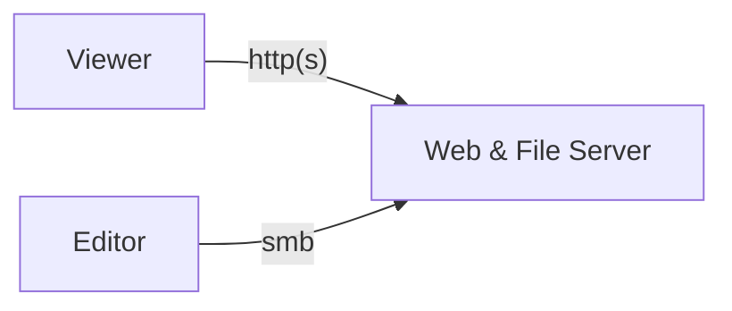

お家の検証サーバ用の備忘録です。基本 root です。

## 前提

<https://zenn.dev/asterisk9101/articles/fedora43server-1>

## 構成

ファイルサーバを読み取り専用にしたかったのですが、権限まわりのメンテナンスが面倒な気がしたので参照側は http にしてみました。

編集側は、`robocopy` のような差分コピーアプリを使って、コンテンツの反映を行います。



## Samba

とりあえずインストール

```bash
dnf -y install samba
```

プリンタ関連の設定は全てコメントアウトし、SMB の暗号化を設定する。

```ini:/etc/samba/smb.conf
[global]
        workgroup = SAMBA
        security = user

        passdb backend = tdbsam

        #printing = cups
        #printcap name = cups
        #load printers = yes
        #cups options = raw

        # Install samba-usershares package for support
        include = /etc/samba/usershares.conf

[homes]
        comment = Home Directories
        valid users = %S, %D%w%S
        browseable = No
        read only = No
        inherit acls = Yes
        
        # SMB 3.0 で暗号化を必須とする
        smb encrypt = required

#[printers]
#       comment = All Printers
#       path = /var/tmp
#       printable = Yes
#       create mask = 0600
#       browseable = No

#[print$]
#       comment = Printer Drivers
#       path = /var/lib/samba/drivers
#       # printadmin is a local group
#       write list = printadmin root
#       force group = printadmin
#       create mask = 0664
#       directory mask = 0775
```

ファイアウォールを開ける。

```bash
firewall-cmd --add-service=samba
firewall-cmd --runtime-to-permanent
```

ユーザーを追加する。

```bash
# ログインシェルを無効化する
useradd -s nologin testuser

# SAMBA 用のパスワードを設定する
smbpasswd -a testuser
```

サービスを起動する

```bash
systemctl enable --now smb
```

ホームディレクトリへアクセスできるようになった。

## Apache httpd

とりあえずインストール。

```bash
dnf -y install httpd
```

新規作成する。

```ini:/etc/httpd/conf.d/userdir.conf
<IfModule mod_userdir.c>
    UserDir public_html
</IfModule>

<Directory "/home/*/public_html">
    # .htaccess での上書きは許可しない
    AllowOverride None

    # AutoIndex は有効にする
    Options Indexes

    # httpd が日本語を正しく解釈できるように
    # NameWidth=* でファイル名を省略しないようにする
    AddDefaultCharset UTF-8
    IndexOptions Charset=UTF-8 NameWidth=*

    # index.html もファイルとして表示する
    DirectoryIndex disable

    Require method GET POST OPTIONS
</Directory>
```

参照するユーザーディレクトリのパーミッションを変更し、Apache httpd がユーザーディレクトリを読み取れるように。

```bash
chmod 711 /home/testuser
```

サービスを起動する。

```bash
systemctl enable --now httpd
```

ファイアウォールを開ける。

```bash
firewall-cmd --add-service=http
firewall-cmd --runtime-to-permanent
```

`http://xxx.xxx.xxx.xxx/~testuser/` にアクセスして、ファイルが一覧で参照できればOK

動作確認は後日やります。
