## 前提

続きです。

<https://zenn.dev/asterisk9101/articles/oraclelinux8-1>

## 参考

この資料をスタンドアロン構成として読み替えながらなぞっていきます。

<https://www.oracle.com/jp/a/tech/docs/technical-resources/21c-racdb-installationguide.pdf>

## preinstall rpm

preinstall rpm というものが用意されているので利用します。
Grid Infrastructure のインストールの前提として必要な設定を一部実施してくれます。

```bash
dnf install -y oracle-database-preinstall-21c
```

`rpm -ql oracle-database-preinstall-21c-1.0-1.el8.x86_64` すると、以下のようになります。

```console
/etc/rc.d/init.d/oracle-database-preinstall-21c-firstboot
/etc/security/limits.d/oracle-database-preinstall-21c.conf
/etc/sysconfig/oracle-database-preinstall-21c
/etc/sysconfig/oracle-database-preinstall-21c/oracle-database-preinstall-21c-verify
/etc/sysconfig/oracle-database-preinstall-21c/oracle-database-preinstall-21c.param
/usr/bin/oracle-database-preinstall-21c-verify
/usr/share/licenses/oracle-database-preinstall-21c
/usr/share/licenses/oracle-database-preinstall-21c/LICENSE
/var/log/oracle-database-preinstall-21c
/var/log/oracle-database-preinstall-21c/results
```

`oracle-database-preinstall-21c-verify` と `oracle-database-preinstall-21c.param` が初期化スクリプトのようです。

## 必要なグループとユーザーを作成

```bash
groupadd -g 54327 asmdba
groupadd -g 54328 asmoper
groupadd -g 54329 asmadmin
useradd -g oinstall -G asmadmin,asmdba,asmoper,racdba grid
```

preinstall rpm で作成された oracle ユーザーは asm 系のグループが足りないので追加します。

```bash
usermod -aG asmdba oracle
```

パスワードの設定。

```bash
passwd oracle
passwd grid

# root.sh を実行するときに必要になるので
passwd root
```

## リソース制限の変更

preinstall rpm で作成された設定ファイルでは不十分だそうです。

```bash
cat << EOF >> /etc/security/limits.d/oracle-database-preinstall-21c.conf
grid soft nproc 2047
grid hard nproc 16384
grid soft nofile 1024
grid hard nofile 65536
grid soft stack 10240
grid hard stack 32768
EOF
```

## デバイスの権限設定

ブロックデバイス(sdb, sdc)の所有者とグループを変更します。

```udev
# vi /etc/udev/rules.d/99-oracle.rules
KERNEL=="sdb", OWNER="grid", GROUP="asmadmin", MODE="0660"
KERNEL=="sdc", OWNER="grid", GROUP="asmadmin", MODE="0660"
```

```bash
# 変更前の確認
ls -l /dev/sd*

# udev ルールのリロード
udevadm control --reload
udevadm trigger

# 変更後の確認
ls -l /dev/sd*
```

以下のようになります。

```console
# ls -l /dev/sd*
brw-rw----. 1 root disk     8,  0  8月 11 18:30 /dev/sda
brw-rw----. 1 root disk     8,  1  8月 11 18:30 /dev/sda1
brw-rw----. 1 root disk     8,  2  8月 11 18:30 /dev/sda2
brw-rw----. 1 grid asmadmin 8, 16  8月 11 18:30 /dev/sdb
brw-rw----. 1 grid asmadmin 8, 32  8月 11 18:30 /dev/sdc
```

## インストールディレクトリの作成

```bash
mkdir -p /u01/app/grid
mkdir -p /u01/app/21.3.0/grid
mkdir -p /u01/app/oracle/product/21.3.0/dbhome_1
mkdir -p /u01/app/oraInventory
chown -R grid:oinstall /u01
chown -R oracle:oinstall /u01/app/oracle
chown -R grid:oinstall /u01/app/oraInventory
chmod -R 775 /u01
```

## インストーラの展開

grid ユーザーで作業します。

```bash
su - grid
```

```bash
# cd /path/to/downloaded_directroy
unzip -d /u01/app/21.3.0/grid xxxxxxxxxxx.zip
```

## gridSetup.sh の実行

GUIでインストールします。
X11はよくわからないのですが、`export DISPLAY=:0` すると画面が表示されるようになりました。

```bash
# トーフ問題を回避するために LANG=C します
export LANG=C

# X11で画面を表示するために DISPLAY変数をエクスポートします。
export DISPLAY=:0

# gridSetup.sh を実行します。
./gridSetup.sh
```

スタンドアロンでインストールします。

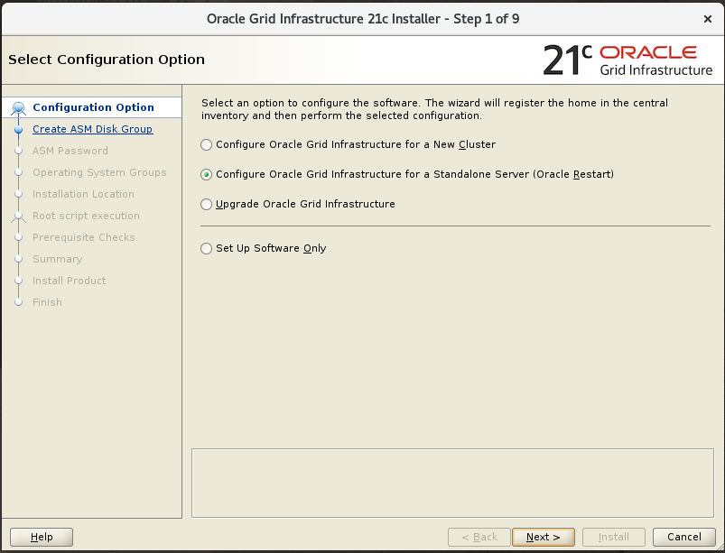

ASM に追加するディスクを選択します。

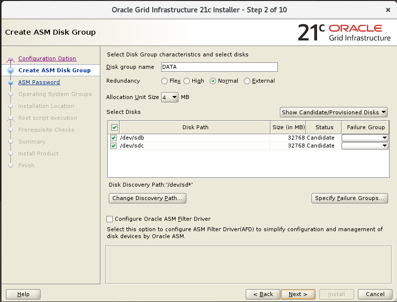

ASM のパスワードを入力します。

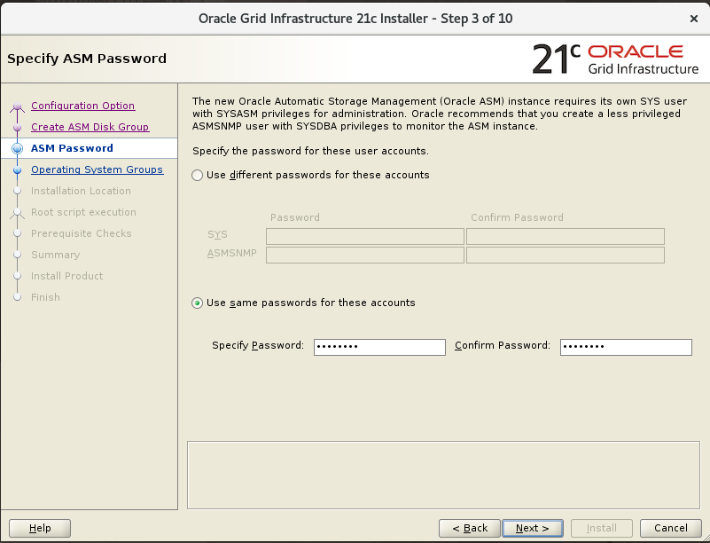

Enterprise Manager Cloud Control は使わないのでそのまま次へ。

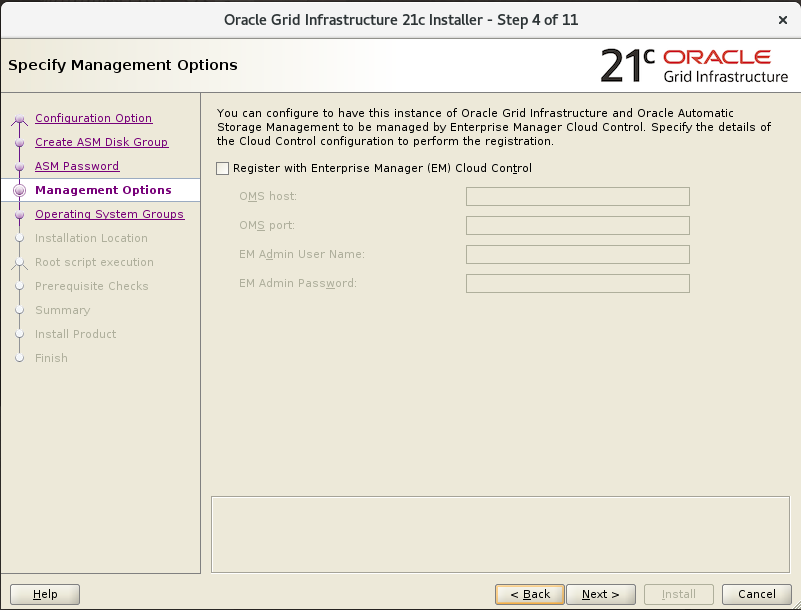

OSのグループにASMの権限を割り当てます。

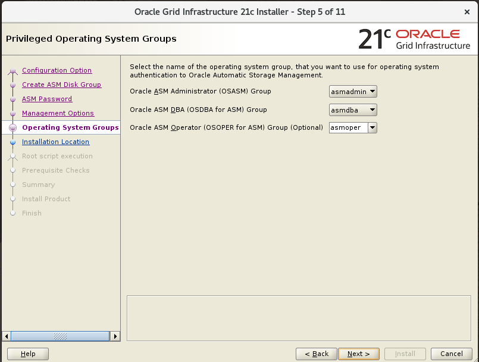

インストールパスを選択します。

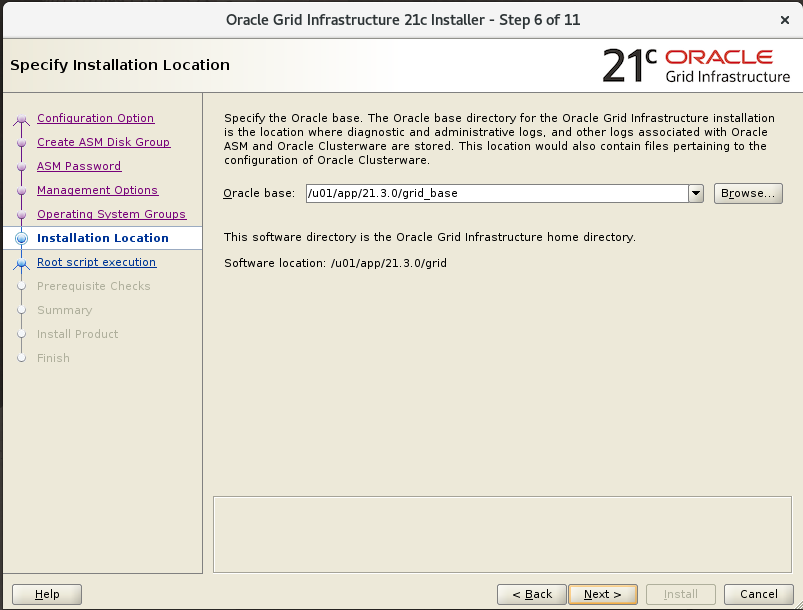

インベントリのパスを選択します。

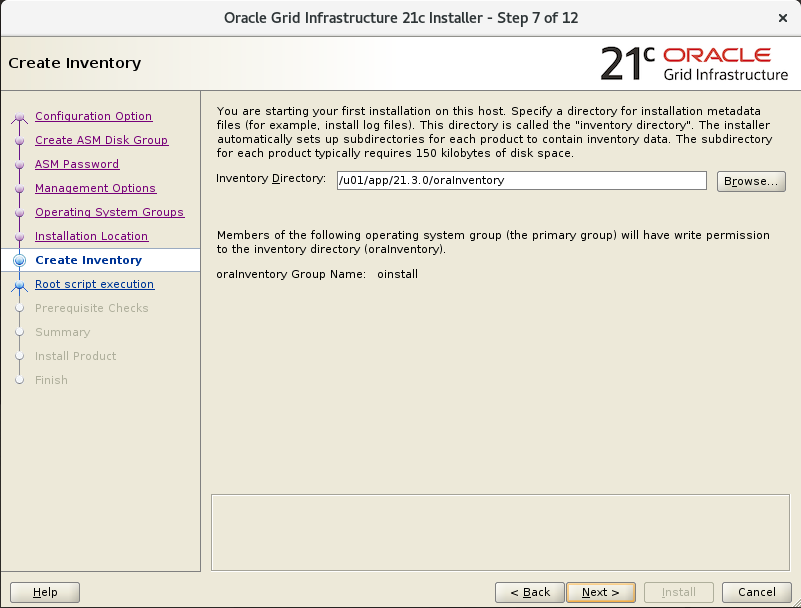

root.sh を実行するためのパスワードを入力します。

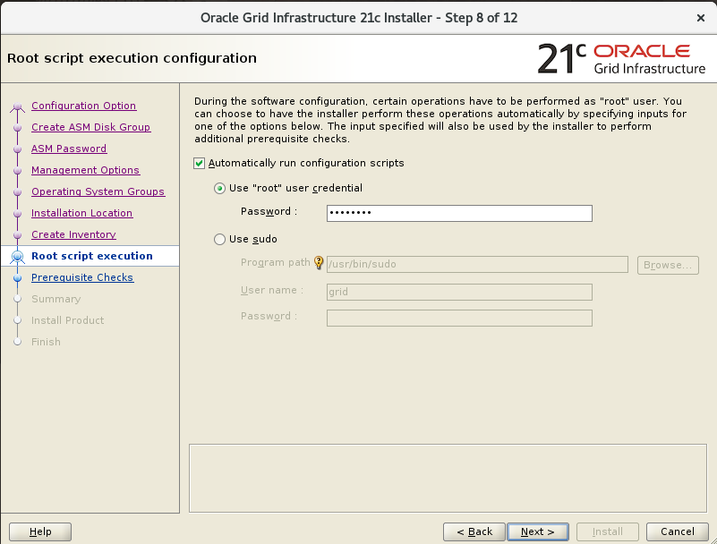

要件のチェックが実施されます。

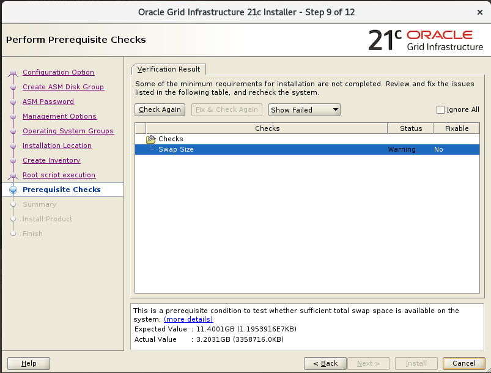

自分の環境ではスワップの不足が指摘されたので追加します。

```bash
# 事前確認
free -h

# root で実行
# 12 GB
BLOCK_SIZE=$((1024 * 12))
dd if=/dev/zero of=/swapfile bs=1M count=$BLOCK_SIZE
chmod 0600 /swapfile
mkswap /swapfile
swapon /swapfile

# 事後確認
free -h
```

swap を永続化します。

```config
# /etc/fstab に追記
/swapfile swap swap defaults 0 0
```

Check Again して Warning を消してから次へ。

確認画面で Install をクリックしてインストールを開始します。

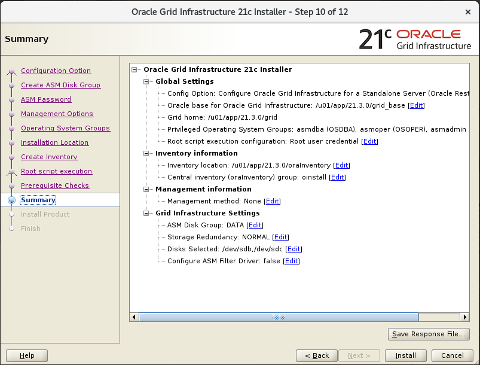

インストール中に警告が出ますが次へ。

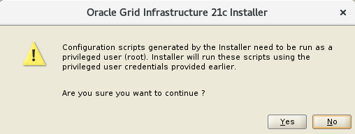

完了しました。

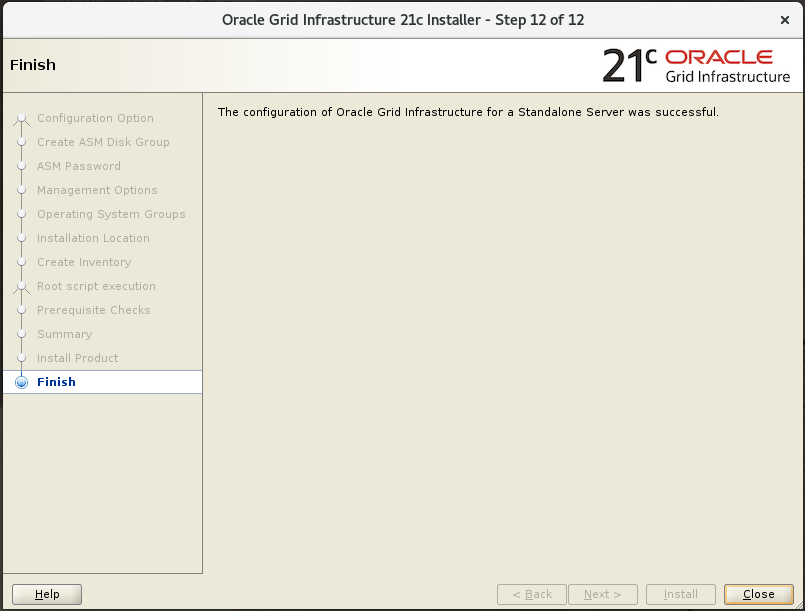

## .bash_profile の設定

コマンドなどへのパスを通すために、grid ユーザーの `.bash_profile` で環境変数をセットします。

```bash
# ~/.bash_profile
export ORACLE_BASE=/u01/app/grid
export ORACLE_HOME=/u01/app/21.3.0/grid
export PATH=$ORACLE_HOME/bin:$PATH
export LANG=ja_JP.UTF-8
export NLS_LANG=Japanese_Japan.AL32UTF8
```

`ps -ef | grep grid` などで、ASM の SID を調べて環境変数にセットしておきます。

```bash
# ~/.bash_profile
export ORACLE_SID=+ASM1
```

## 稼働状況の確認

grid ユーザーでログインし直します。

以下のコマンドを実行して、クラスターのリソースが ONLINE になっているか確認します。

```bash
crsctl status res -t
```

出力例です。OFFLINE もありますが、スタンドアロン構成であれば正常だそうです。

```console
--------------------------------------------------------------------------------
Name           Target  State        Server                   State details
--------------------------------------------------------------------------------
Local Resources
--------------------------------------------------------------------------------
ora.DATA.dg
               ONLINE  ONLINE       xx-oracle8               STABLE
ora.LISTENER.lsnr
               ONLINE  ONLINE       xx-oracle8               STABLE
ora.asm
               ONLINE  ONLINE       xx-oracle8               Started,STABLE
ora.ons
               OFFLINE OFFLINE      xx-oracle8               STABLE
--------------------------------------------------------------------------------
Cluster Resources
--------------------------------------------------------------------------------
ora.cssd
      1        ONLINE  ONLINE       xx-oracle8               STABLE
ora.diskmon
      1        OFFLINE OFFLINE                               STABLE
ora.evmd
      1        ONLINE  ONLINE       xx-oracle8               STABLE
--------------------------------------------------------------------------------
```

以下のコマンドを実行して、asm サービスが起動しているか確認します。

```bash
# ASM の起動状態の確認
srvctl status asm

# ASM 構成情報の確認
srvctl config asm
```

以下のコマンドを実行して、ASMのディスク構成を確認します。

```bash
# ディスクグループの一覧の確認
asmcmd lsdg

# DATA ディスクグループに含まれるディスクの確認
asmcmd lsdsk -G DATA
```

## 次

<https://zenn.dev/asterisk9101/articles/oraclelinux8-3>
